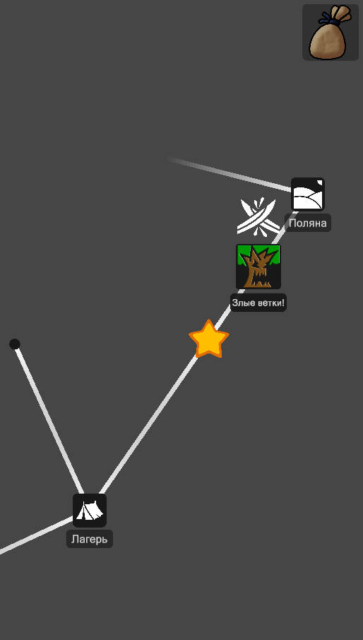
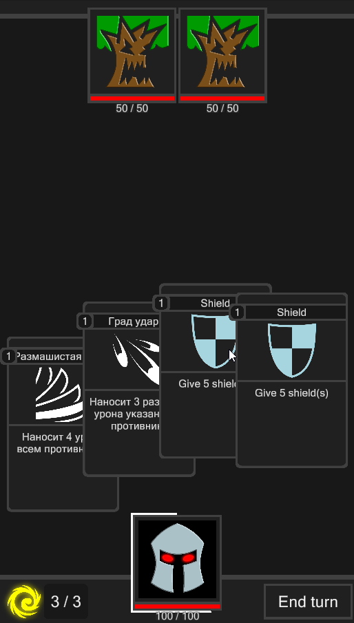
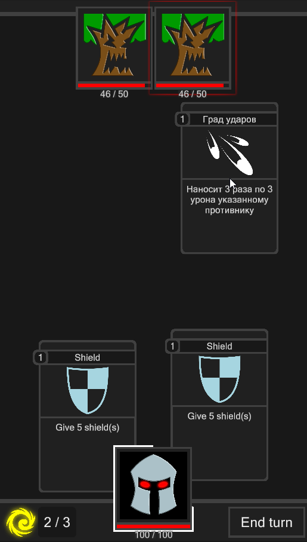
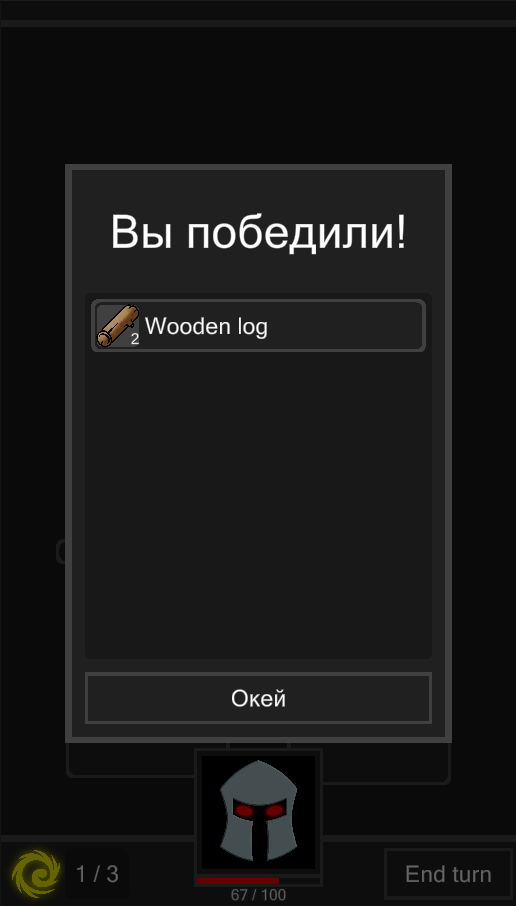
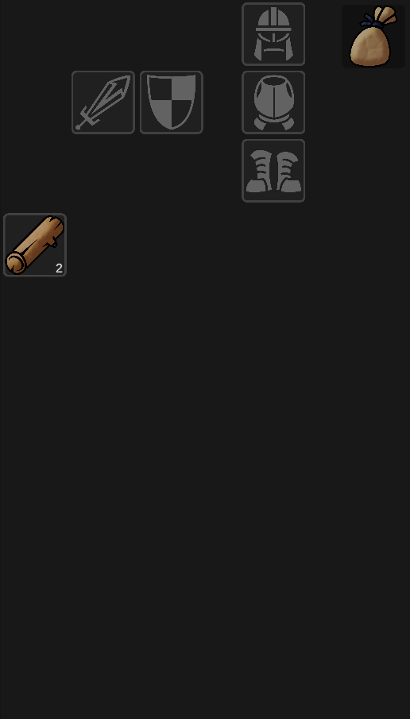

# CardGame
 
Это прототип карточной игры, где предстоит сражаться против одного или группы противников путешествуя по карте, выполняя задания, а также собирая, создавая и улучшая артефакты.

Игра в стадии демки, она демонстрирует принципиальную возможность данного типа игры, реализует  базовую архитектуру игры, и имеет минимум контента.

Стоит отметить что игра не доработана до конца, и в ней присутствуют некоторые известные проблемы.

# Gameplay

Запись геймплея.

В игре присутствует карта, открывающаяся по мере изучения.

Во время боя каждый ход игроку доступен выбор из нескольких карт, не использованные будут сброшены в стопку сброса в конце хода.

У карт есть возможные назначения, в примере ниже карту необходимо использовать на конкретную цель, выбрать ее можно просто поднеся карту к цели до тех пор, пока не появится характерная обводка.

После победы игрок может забрать заслуженные награды, либо же проигнорировать их.

В ходе исследования мира, выполнения заданий и победы над противниками у него будут появляться материалы и артефакты, с которыми он сможет взаимодействовать в инвентаре.

# Roadway

[+] Система бой  
[+] Система инвентаря  
[+] Карта  
[-] Крафт предметов  
[-] Задания  
[-] Наполнение контентом  